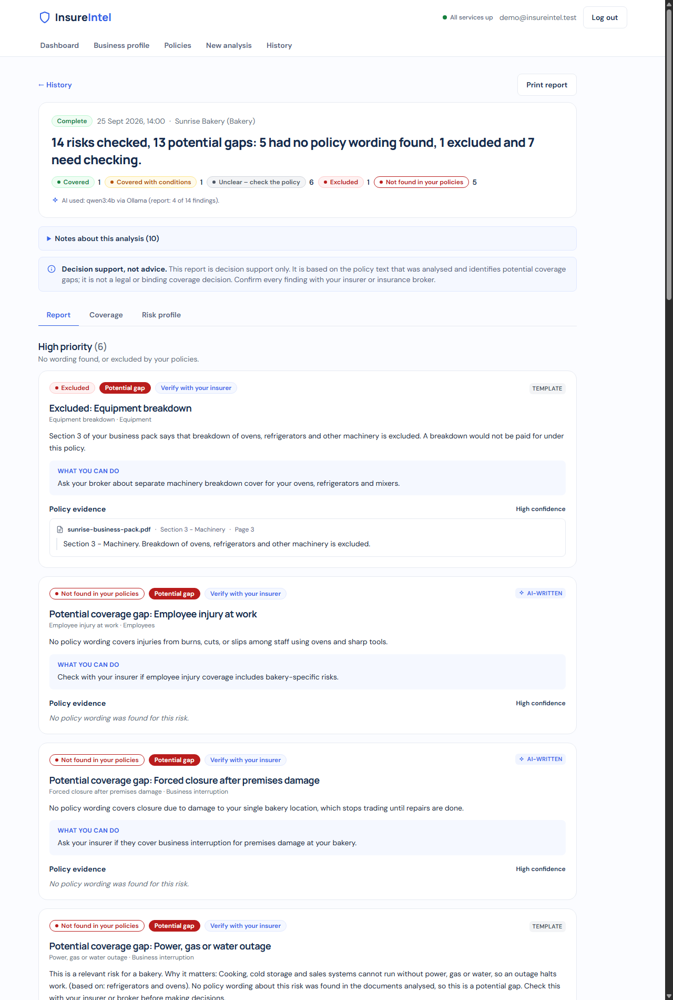

# AI-Driven Insurance Coverage Intelligence & Gap Detection System

An Agentic AI-powered InsurTech platform that helps SMEs understand their insurance coverage by identifying business risks, analyzing existing insurance policies, detecting potential coverage gaps, and generating evidence-based explanations.

## 📌 Overview

Small and medium-sized businesses often have multiple insurance policies but may not fully understand what risks are covered, what is excluded, what conditions apply, or where potential gaps exist.

Manually reviewing insurance policies and comparing them with the actual risks of a business can be time-consuming and difficult, especially when policies contain lengthy and complex documents.

This project proposes an **Agentic AI-based Insurance Coverage Intelligence System** that automates this analysis through a coordinated set of specialized AI agents.

The system takes:

- A business profile
- Existing insurance policy documents

and produces:

- Identified business risks
- Relevant insurance policy clauses
- Coverage analysis
- Potential coverage gaps
- Evidence-based explanations and recommendations

> **Note:** The system is intended as a decision-support tool and does not provide legally binding insurance advice. Coverage decisions should be verified with the relevant insurer or insurance professional.

---

## 🎯 Problem Statement

SMEs may purchase insurance policies without having a clear understanding of whether those policies adequately address the risks associated with their actual business operations.

For example, a bakery may have risks such as:

- Fire
- Equipment breakdown
- Theft
- Business interruption
- Employee injury
- Public liability
- Cyber risks
- Payment fraud

However, the business owner may not know whether these risks are:

- Covered
- Excluded
- Covered only under certain conditions
- Not clearly addressed by the existing policies

The proposed system addresses this problem by systematically comparing **business risks against insurance policy coverage**.

---

## 💡 Proposed Solution

The system uses multiple specialized AI agents that work together as an end-to-end workflow.

```text
                 Business Profile
                        │
                        ▼
              ┌──────────────────┐
              │  Risk Profiling   │
              │      Agent        │
              └────────┬─────────┘
                       │
                       ▼
                  Business Risks
                       │
                       ▼
              ┌──────────────────┐
              │ Policy Intelligence│
              │      Agent        │
              └────────┬─────────┘
                       │
                       ▼
              Relevant Policy Evidence
                       │
                       ▼
              ┌──────────────────┐
              │ Coverage & Gap    │
              │ Analysis Agent    │
              └────────┬─────────┘
                       │
                       ▼
              Coverage Assessment
                       │
                       ▼
              ┌──────────────────┐
              │ Explanation &     │
              │ Recommendation    │
              │      Agent        │
              └────────┬─────────┘
                       │
                       ▼
              Evidence-Based Report
```

The four agents never talk to the user directly. An **orchestration gateway** (port 8000) handles
login, stores policies and results, and calls the agents in order. See
[docs/architecture.md](docs/architecture.md) for the full design and
[docs/api-specification.md](docs/api-specification.md) for the endpoints.

---

## 🚀 Running the system

### 1. Install

```bash
python -m venv venv
venv\Scripts\activate            # Windows (Linux/macOS: source venv/bin/activate)
pip install -r requirements.txt
```

OCR of scanned PDFs also needs the separate [Tesseract](https://github.com/tesseract-ocr/tesseract)
program. Without it, set `OCR_ENABLED=false`.

### 2. Configure

Copy `.env.example` to `.env` and fill in the three secrets:

| Variable | Used for | Generate with |
|---|---|---|
| `INTERNAL_API_KEY` | `X-API-Key` between the gateway and the agents | any long random string |
| `DOCUMENT_ENCRYPTION_KEY` | encrypting uploaded PDFs and stored results | `python -c "from cryptography.fernet import Fernet; print(Fernet.generate_key().decode())"` |
| `JWT_SECRET_KEY` | signing login tokens (login is refused without it) | `python -c "import secrets; print(secrets.token_urlsafe(48))"` |

LLM (optional): `LLM_PROVIDER=ollama` with a local `OLLAMA_MODEL`, or `LLM_PROVIDER=gemini`
with `GEMINI_API_KEY`. Every agent still works without an LLM, using rules and template wording.
On a 16 GB laptop use `OLLAMA_MODEL=qwen3:4b` (`qwen3:8b` does not fit) and close large apps while
a report is written; Agent 4 then takes about 5–6 minutes. Agent 1's AI step only uses Gemini, so
without `GEMINI_API_KEY` it is rule-based.

Keep the agent URLs on `127.0.0.1`, not `localhost`. On Windows `localhost` adds about 2 seconds
to every agent call.

### 3. Start all services

```powershell
.\scripts\start_agents.ps1          # PowerShell
.\scripts\start_agents.ps1 -NoLlm   # without any LLM (rules + templates only)
```

```bash
bash scripts/start_agents.sh            # Git Bash / Linux / macOS
bash scripts/start_agents.sh --no-llm
```

This starts Agents 1-4 (ports 8001-8004) and the gateway (port 8000). Logs go to `logs/`, and
Ctrl+C stops everything. The gateway API docs are at http://127.0.0.1:8000/docs.

### 4. Open the web app

The frontend is a React app in `frontend/` (Vite, TypeScript, Tailwind). It needs
[Node.js](https://nodejs.org/) 20 or newer. In a second terminal, with the services from step 3
running:

```bash
cd frontend
npm install        # once
npm run dev        # http://127.0.0.1:5173
```

Register an account, fill in the business profile, upload policy PDFs and run an analysis. The
dev server forwards `/api` and `/health` to the gateway on `127.0.0.1:8000`, so the gateway needs
no CORS. With a local LLM the analysis page shows progress for several minutes; the result is also
saved to History, so the page can be left.

**Without the backend:** `npm run dev:mocks` answers every call from a built-in mock API with
real, saved analysis results. Log in as `demo@insureintel.test` / `demo-password-1`. Error cases can
be triggered with special inputs, listed at the top of `frontend/src/mocks/handlers.ts` (for
example the business name `Timeout Ltd`, or the password `wrong`). The mock data is regenerated
with `python scripts/make_frontend_fixtures.py` (add `--use-llm` for real LLM wording).



More screenshots are in [docs/images/frontend/](docs/images/frontend/), and
[docs/demo-script.md](docs/demo-script.md) walks through a full demo.

### 5. Check the whole chain

```bash
python scripts/smoke_test_gateway.py
```

This registers a test user, uploads a synthetic policy PDF, runs one analysis through all four
agents and prints the findings.

### 6. Tests

```bash
pytest
```

The tests need no network, no API keys and no LLM.
`tests/integration/test_orchestration_real_agents.py` runs the gateway with all four real agents
in-process.

Frontend (from `frontend/`), also with no backend needed:

```bash
npm test           # Vitest + React Testing Library, against the mock API
npm run lint       # ESLint + Prettier
npm run typecheck  # TypeScript
npm run build      # production build in frontend/dist
```
