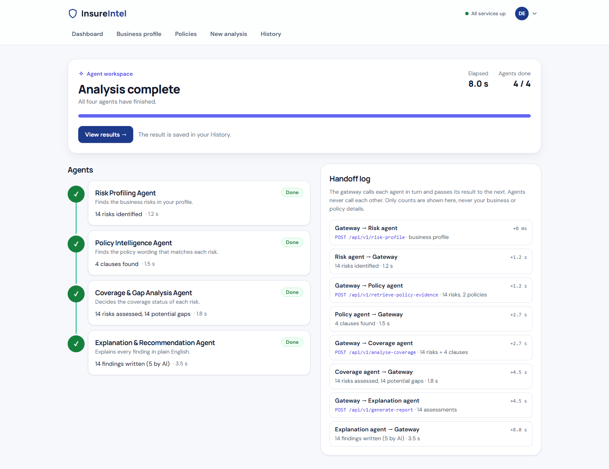
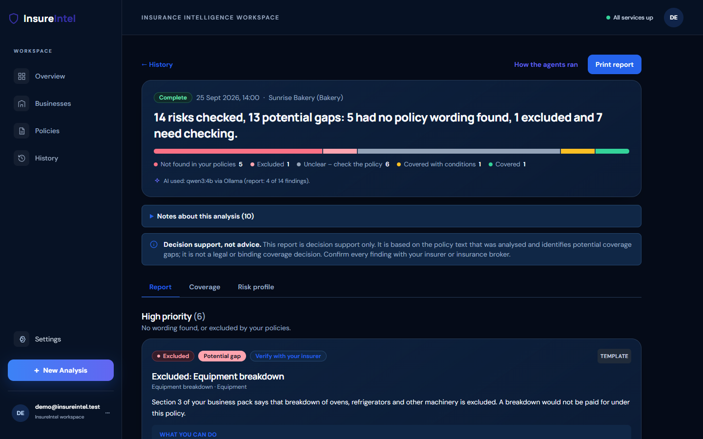
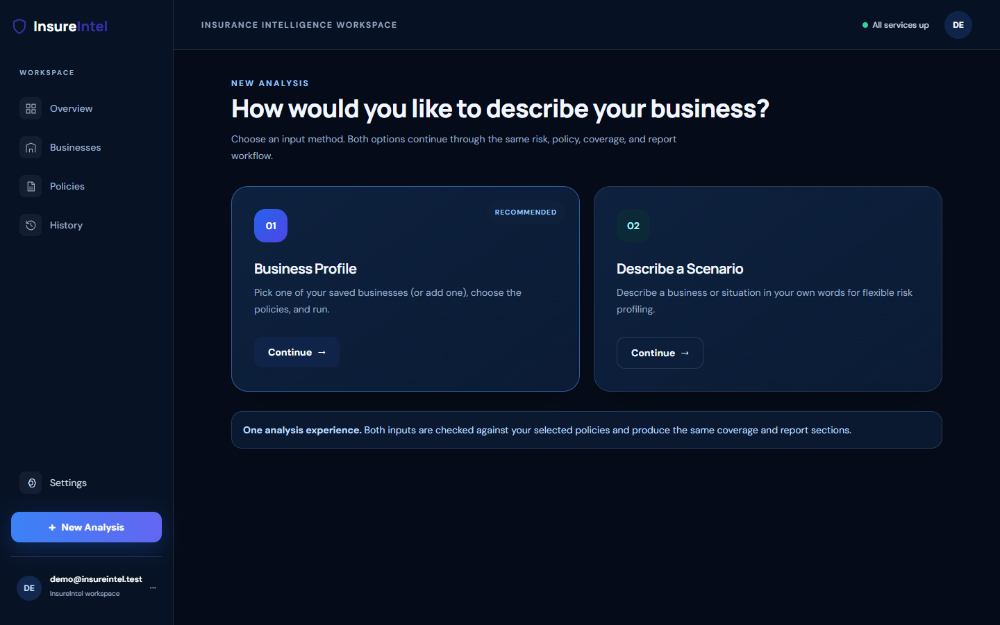

# AI-Driven Insurance Coverage Intelligence & Gap Detection System

An Agentic AI-powered InsurTech platform that helps SMEs understand their insurance coverage by identifying business risks, analyzing existing insurance policies, detecting potential coverage gaps, and generating evidence-based explanations.

## 📌 Overview

Small and medium-sized businesses often have multiple insurance policies but may not fully understand what risks are covered, what is excluded, what conditions apply, or where potential gaps exist.

Manually reviewing insurance policies and comparing them with the actual risks of a business can be time-consuming and difficult, especially when policies contain lengthy and complex documents.

This project proposes an **Agentic AI-based Insurance Coverage Intelligence System** that automates this analysis through a coordinated set of specialized AI agents.

The system takes:

- A business profile, or a description of the business or situation in the user's own words
- Existing insurance policy documents

and produces:

- Identified business risks
- Relevant insurance policy clauses
- Coverage analysis
- Potential coverage gaps
- Evidence-based explanations and recommendations

> **Note:** The system is intended as a decision-support tool and does not provide legally binding insurance advice. Coverage decisions should be verified with the relevant insurer or insurance professional.

---

## 🎯 Problem Statement

SMEs may purchase insurance policies without having a clear understanding of whether those policies adequately address the risks associated with their actual business operations.

For example, a bakery may have risks such as:

- Fire
- Equipment breakdown
- Theft
- Business interruption
- Employee injury
- Public liability
- Cyber risks
- Payment fraud

However, the business owner may not know whether these risks are:

- Covered
- Excluded
- Covered only under certain conditions
- Not clearly addressed by the existing policies

The proposed system addresses this problem by systematically comparing **business risks against insurance policy coverage**.

---

## 💡 Proposed Solution

The system uses multiple specialized AI agents that work together as an end-to-end workflow.

```text
                 Business Profile
                        │
                        ▼
              ┌──────────────────┐
              │  Risk Profiling   │
              │      Agent        │
              └────────┬─────────┘
                       │
                       ▼
                  Business Risks
                       │
                       ▼
              ┌──────────────────┐
              │ Policy Intelligence│
              │      Agent        │
              └────────┬─────────┘
                       │
                       ▼
              Relevant Policy Evidence
                       │
                       ▼
              ┌──────────────────┐
              │ Coverage & Gap    │
              │ Analysis Agent    │
              └────────┬─────────┘
                       │
                       ▼
              Coverage Assessment
                       │
                       ▼
              ┌──────────────────┐
              │ Explanation &     │
              │ Recommendation    │
              │      Agent        │
              └────────┬─────────┘
                       │
                       ▼
              Evidence-Based Report
```

The four agents never talk to the user directly. An **orchestration gateway** (port 8000) handles
login, stores policies and results, and calls the agents in order. See
[docs/architecture.md](docs/architecture.md) for the full design and
[docs/api-specification.md](docs/api-specification.md) for the endpoints.

---

## ✨ What the web app does

| Feature | What the user sees | More detail |
|---|---|---|
| **Two ways to start** | **New Analysis** asks how to describe the business: a saved **business profile**, or **Describe a Scenario** in free text. Both go through the same four agents and produce the same report. | [docs/api-specification.md](docs/api-specification.md) |
| **Business profile** | 11 business types in three groups (food and drink, shops, services), plus **Other** with a free-text description. Only the name and type are required; "Not sure" is never treated as No. | [docs/input-specification.md](docs/input-specification.md) |
| **Scenario analysis** | Up to 4,000 characters about the business, its equipment, staff, customers or concerns. Agent 1 identifies the risks from the text, quoting the words behind each one. | [docs/api-specification.md](docs/api-specification.md) |
| **Risk profiling** | Up to 19 business risks in seven categories, each with the profile answers that triggered it. | [docs/risk-taxonomy.md](docs/risk-taxonomy.md) |
| **Policy upload** | PDFs are checked by content, stored encrypted and split into sections. Instruction-like wording is flagged and never sent to an AI. | [docs/api-specification.md](docs/api-specification.md) |
| **Agent workspace** | While an analysis runs: the four stages and what each returned. **Show technical details** opens each agent's card and a **handoff log** of every message between the gateway and the agents (counts only, no business data). The run continues if the page is left, and a failed run can be retried. | [docs/architecture.md](docs/architecture.md) |
| **Results** | Report, Coverage and Risk profile tabs. Clicking a risk opens an **evidence panel** with the quoted policy wording (policy, section, page) and which agent produced each part. Every AI-written text is labelled. **Print report** prints every section on clean white pages (or saves a PDF). | [docs/responsible-ai.md](docs/responsible-ai.md) |
| **History** | Every profile and scenario analysis, newest first, stored encrypted. The Overview page shows a setup checklist and the latest analysis; the header shows whether all four agents are up. | [docs/architecture.md](docs/architecture.md) |
| **Ask about this analysis** | Questions answered only from the saved analysis and the clauses it found, with citations. Questions it cannot answer are said to be out of scope, not guessed. | [docs/api-specification.md](docs/api-specification.md) |
| **Consent** | Registration requires agreeing to the privacy and data processing notice (`/privacy`); the notice version and time are stored with the account. | [docs/responsible-ai.md](docs/responsible-ai.md) |
| **Pricing** | Proposed plans in LKR (Free, Starter, Business, Broker) on the landing page. The prototype takes no payments. | [docs/commercialisation.md](docs/commercialisation.md) |



---

## 🚀 Running the system

### 1. Install

```bash
python -m venv venv
venv\Scripts\activate            # Windows (Linux/macOS: source venv/bin/activate)
pip install -r requirements.txt
```

OCR of scanned PDFs also needs the separate [Tesseract](https://github.com/tesseract-ocr/tesseract)
program. Without it, set `OCR_ENABLED=false`.

### 2. Configure

Copy `.env.example` to `.env` and fill in the three secrets:

| Variable | Used for | Generate with |
|---|---|---|
| `INTERNAL_API_KEY` | `X-API-Key` between the gateway and the agents | any long random string |
| `DOCUMENT_ENCRYPTION_KEY` | encrypting uploaded PDFs and stored results | `python -c "from cryptography.fernet import Fernet; print(Fernet.generate_key().decode())"` |
| `JWT_SECRET_KEY` | signing login tokens (login is refused without it) | `python -c "import secrets; print(secrets.token_urlsafe(48))"` |

LLM (optional): `LLM_PROVIDER=ollama` with a local `OLLAMA_MODEL`, or `LLM_PROVIDER=gemini`
with `GEMINI_API_KEY`. Every agent still works without an LLM, using rules and template wording.
On a 16 GB laptop use `OLLAMA_MODEL=qwen3:4b` (`qwen3:8b` does not fit) and close large apps while
a report is written; Agent 4 then takes about 5–6 minutes. Agent 1's AI step only uses Gemini, so
without `GEMINI_API_KEY` it is rule-based.

Keep the agent URLs on `127.0.0.1`, not `localhost`. On Windows `localhost` adds about 2 seconds
to every agent call.

### 3. Start all services

```powershell
.\scripts\start_agents.ps1          # PowerShell
.\scripts\start_agents.ps1 -NoLlm   # without any LLM (rules + templates only)
```

```bash
bash scripts/start_agents.sh            # Git Bash / Linux / macOS
bash scripts/start_agents.sh --no-llm
```

This starts Agents 1-4 (ports 8001-8004) and the gateway (port 8000). Logs go to `logs/`, and
Ctrl+C stops everything. The gateway API docs are at http://127.0.0.1:8000/docs.

### 4. Open the web app

The frontend is a React app in `frontend/` (Vite, TypeScript, Tailwind). It needs
[Node.js](https://nodejs.org/) 20 or newer. In a second terminal, with the services from step 3
running:

```bash
cd frontend
npm install        # once
npm run dev        # http://127.0.0.1:5173
```

Register an account, upload policy PDFs, then choose **New Analysis** and either use a business
profile or describe a scenario. The dev server forwards `/api` and `/health` to the gateway on
`127.0.0.1:8000`, so the gateway needs no CORS. A run opens the agent workspace, which shows each
agent as it works. With a local LLM
this takes several minutes; the analysis runs on the server and is saved to History, so the page
can be left.

**Demo account:** with the services running, `python scripts/seed_demo.py` creates
`demo@insureintel.test` / `demo-password-1` with two synthetic policies and a finished analysis,
so there is something to show straight away. Run it again to add another analysis. If the agents
use an LLM, the seeded report is AI-written (this takes about 5–6 minutes). It is a known password:
for your own machine only.

**Without the backend:** `npm run dev:mocks` answers every call from a built-in mock API with
real, saved analysis results. Log in as `demo@insureintel.test` / `demo-password-1`. Error cases can
be triggered with special inputs, listed at the top of `frontend/src/mocks/handlers.ts` (for
example the business name `Timeout Ltd`, or the password `wrong`). The mock data is regenerated
with `python scripts/make_frontend_fixtures.py` (add `--use-llm` for real LLM wording).





More screenshots are in [docs/images/frontend/](docs/images/frontend/), and
[docs/demo-script.md](docs/demo-script.md) walks through a full demo.

### 5. Check the whole chain

```bash
python scripts/smoke_test_gateway.py
```

This registers a test user, uploads a synthetic policy PDF, runs one analysis through all four
agents and prints the findings.

### 6. Tests

```bash
pytest
```

The tests need no network, no API keys and no LLM.
`tests/integration/test_orchestration_real_agents.py` runs the gateway with all four real agents
in-process.

Frontend (from `frontend/`), also with no backend needed:

```bash
npm test           # Vitest + React Testing Library, against the mock API
npm run lint       # ESLint + Prettier
npm run typecheck  # TypeScript
npm run build      # production build in frontend/dist
```
